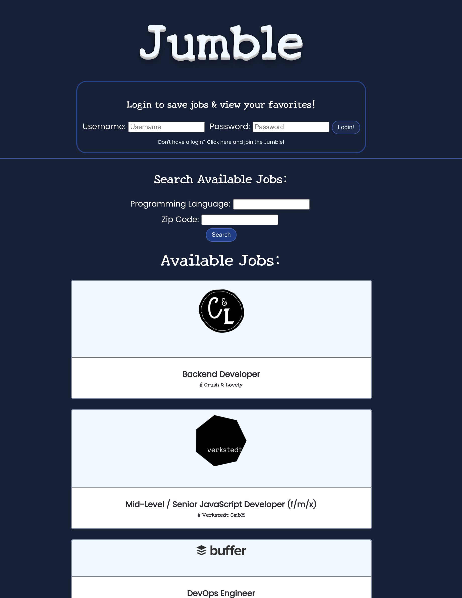
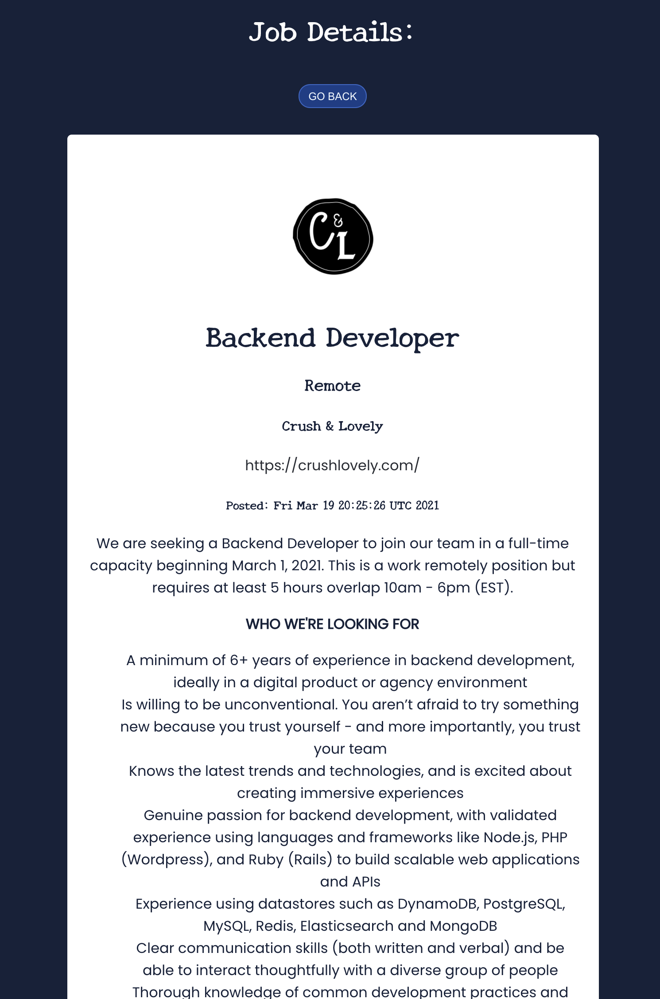
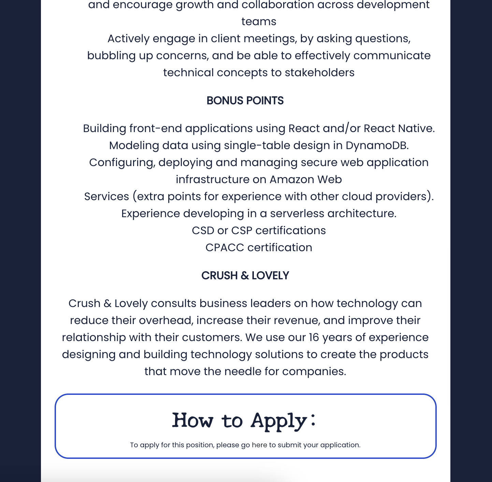
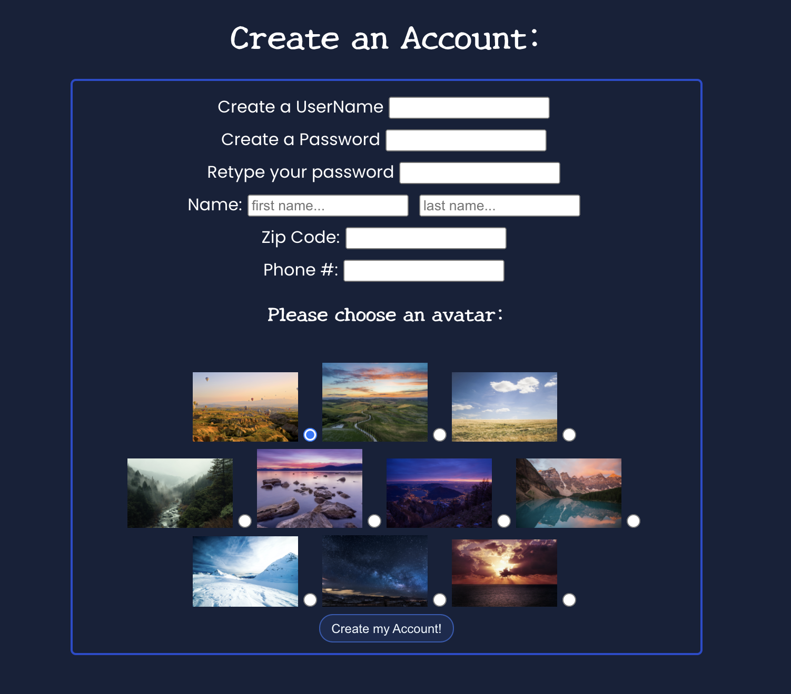
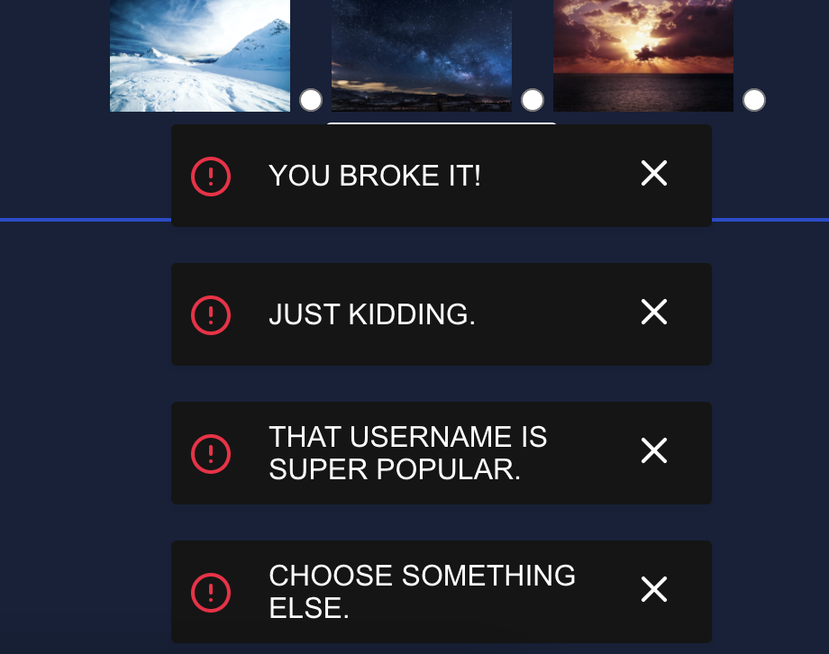
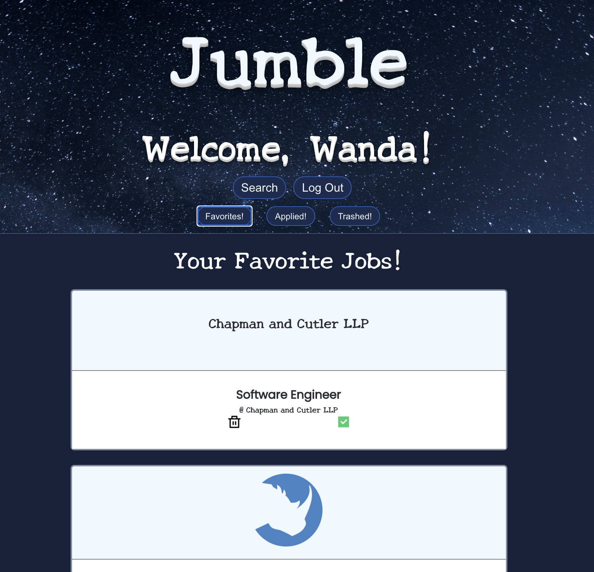
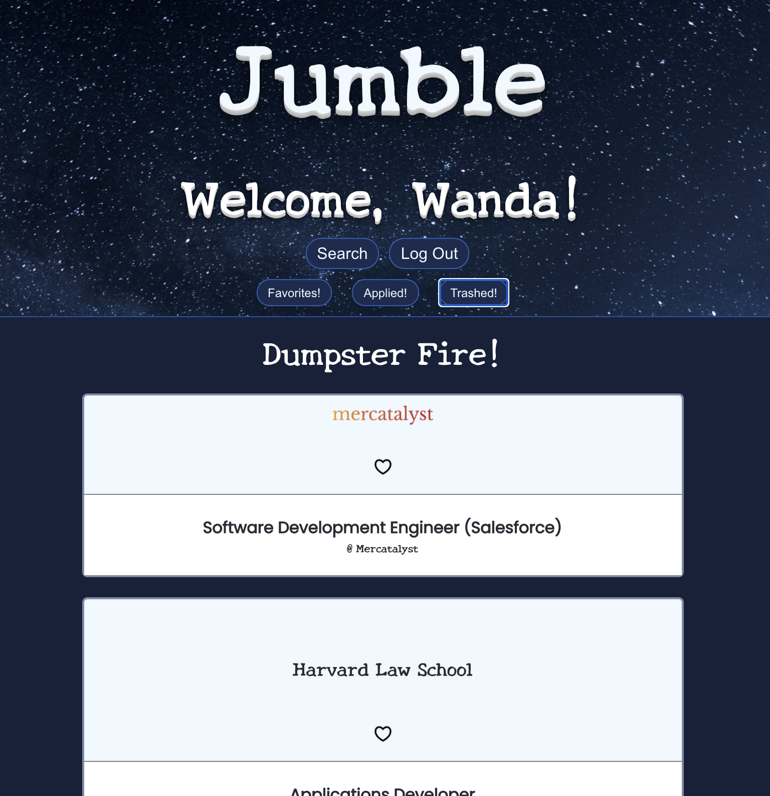

## Jumble

A job search app to help you find your perfect match!
https://jumble.netlify.app

## Description

In Jumble, you can search the jobs, see the details and how to apply. You can also sign in to create a favorites list and keep track of the jobs you have applied to. This was a solo react project.

## Motivation

Recently, I was talking to a friend of mine and we agreed that searching for a job was like dating. Just like Bumble puts the control in the hands of the ladies, I wanted to put the control in the hands of the searcher. And just like Tinder lets daters quickly scroll through jobs, I wanted to create a way to quickly organize your job search.

## Challenges and Solutions

With this app, I got to explore some new libraries, like react swipeable and react alerts, and practice using their documentation to implement them. I also was able to practice both end to end testing with cypress and component testing with react component testing. Finally, I was able to create API call to an external API, make calls to my API that I built with Postges, and deploy using continuous deployment through GitHub with Heroku and Netlifly! Lot of fun new things!

## Screenshots

The login screen appears above the search boxes. Users can search by a language, a zip code, or both.

<br>
<br>
If a job is clicked on, it opens the Job Details page.

<br>
<br>
The Job Details has a "How to Apply" section to make applying for jobs a breeze!

<br>
<br>
If you need to create an account, you can do so here. Avatars will appear as cover photos behind the welcome message.

<br>
<br>
Error messages if you enter a Username that is already taken.

<br>
<br>
Once logged in, users can view Favorites, Applied, and Deleted jobs. These can be chose by clicking the appropriate icons or swipe right to favorite and left to delete.

<br>
<br>
Finally, deleted jobs go into the Dumpster fire where users can bring them back by favoriting them.


## Tech/framework used

Ex. -

<b>Built with</b>

-

## Features

- Ability for users to save jobs
- Users can easily sort through job list with swiping
- Users can also scroll through the list and use icons to save and mark as applied
- Users can see job details
- Users can easily search jobs based on parameters

## Code Example

back-end query:

```
static async addUser(
    username,
    password,
    first_name,
    last_name,
    zip_code,
    phone_num,
    picture
  ) {
    try {
      const query = `INSERT INTO users (username, password, first_name, last_name, zip_code, phone_num, picture) VALUES ('${username}',  '${password}', '${first_name}', '${last_name}', '${zip_code}', '${phone_num}', '${picture}') RETURNING id;`;
      const response = await db.one(query);
      return response;
    } catch (error) {
      return error.message;
    }
  }
```

  <br>

Sending data to the back-end to make the api call:

```

const _handleSubmit = async (e) => {
  e.preventDefault();
  setSearch(true);
  const submitResponse = await fetch(
    `${process.env.REACT_APP_SERVER_URL}jobs/?progLang=${progLang}&zip=${zip}`,
    {
      method: "GET",
      headers: { "Content-Type": "application/json" },
    }
  )
    .then((response) => response.json())
    .catch((e) => {
      console.log(e);
    });
  console.log("This is the jobList DATA: ", submitResponse);
  if (submitResponse) {
    if (submitResponse.length > 0) {
      setJobsList(
        submitResponse.filter(
          (job) =>
            !favoritesList.some((faveJob) => job.id === faveJob.job_id) &&
            !appliedList.some((appliedJob) => job.id === appliedJob.job_id) &&
            !trashedList.some((trashedJob) => job.id === trashedJob.job_id)
        )
      );
      setSubmitError(null);
      setIsEmpty(false);
    } else {
      setSearch(false);
      setIsEmpty(true);
    }
  } else {
    setSubmitError(
      "You've been triple crystalized!!!! i.e. you don't have any data coming in..."
    );
  }
};
```

Creating Alerts! So fun!

```
else {
      myAlert.error("You broke it!");
      setTimeout(() => {
        myAlert.error("Just kidding.");
      }, 1000);
      setTimeout(() => {
        myAlert.error("That username is super popular.");
      }, 2000);
      setTimeout(() => {
        myAlert.error("Choose something else.");
      }, 3000);
      setUsernameTaken(true);
    }

```

## API Reference

https://jobs.github.com

## Tests

Both Cypress and react component tests were creating and run. However, this app is not strictly TDD.

## Back-End

https://github.com/crystalatk/jumble_back

## Use it!

Go to:
https://jumble.netlify.app/
